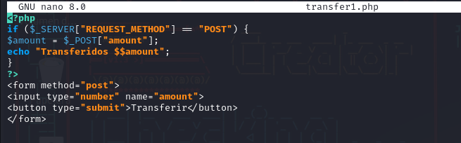
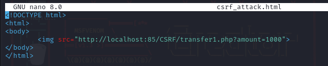

# Explotación y Mitigación de CSRF

En esta práctica vamos a realizar la explotación y mitigación de ataques ***Cross-Site Request Forgery (CSRF)**

## Indice

> 1. [Explotación](#explotación-de-csrf)
> 2. [Mitigación](#mitigación-de-ataques-csrf)

## Explotación de CSRF

Vamos a crear un archivo vulnerable llamado [transfer1.php](./Recursos/transfer1.php):

El código no verifica el origen de la solicitud y cualquier página externa puede enviar una petición maliciosa.

El atacante crea un archivo malicioso [csrf_attack.html](./Recursos/csrf_attack.html):

## Mitigación de ataques CSRF
