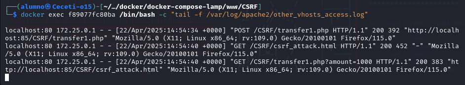
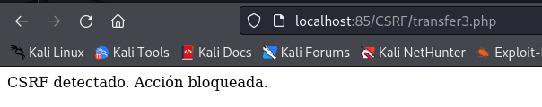

# Explotación y Mitigación de CSRF

En esta práctica vamos a realizar la explotación y mitigación de ataques ***Cross-Site Request Forgery (CSRF)**

## Indice

> 1. [Explotación](#explotación-de-csrf)
> 2. [Mitigación](#mitigación-de-ataques-csrf)

## Explotación de CSRF

Vamos a crear un archivo vulnerable llamado [transfer1.php](./Recursos/transfer1.php):


El código no verifica el origen de la solicitud y cualquier página externa puede enviar una petición maliciosa.

El atacante crea un archivo malicioso [csrf_attack.html](./Recursos/csrf_attack.html):


Cuando el usuario autenticado accede a esta página:


Se transfiere el dinero sin que el usuario lo sepa, (lo comprobamos mirando en los logs del servicio web metiendo el siguiente comando:

```
 ***docker exec lamp-php83 /bin/bash -c "tail -f /var/log/apache2/other_vhosts_access.log"***:
```



El servidor respondió con 200 OK, lo que significa que la transacción se realizó sin que el usuario lo notara.

Podemos crear una variante que inserte un formulario automático en una página legítima, con una estética muy parecida al diseño original, para engañar a la víctima:

Creamos el archivo [csrf_attack2.html](./Recursos/csrf_attack2.html):


El usuario al realizar una transferencia, no se dá cuenta que en realidad ha realizado una transferencia a la cuenta del atacante:


## Mitigación de ataques CSRF

### Validación de token CSRF

Creamos un fichero llamado [transfer2.php](./Recursos/transfer2.php) que es una mejora de ***transfer.php*** que incluye una validación de token CSRF:

Si en el navegador ahora ejecutamos *csrf_attack2.html* sale:


### Probamos varias  mitigaciones

Creamos el siguiente fichero: [transfer3.php](./Recursos/transfer3.php) que incluye las siguientes mitigaciones:

1. Bloquea todas las solicitudes GET (ya no se puede usar  para ataques CSRF).
2. Verifica que el csrf_token coincida con el de la sesión.
3. Verifica que la solicitud provenga del mismo dominio (HTTP_REFERER).
4. Exige que las solicitudes sean AJAX (X-Requested-With: XMLHttpRequest).

Si ejecutamos *csrf_attack2.html* redirecciona a ***transfer3.php*** y sale lo siguiente (ya que no se valida el token correctamente):


